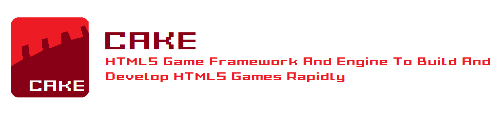

# Cake
A HTML5 Game Framework/Engine To Make HTMl5 Games Rapidly!!!


## How Much Is It Easy?
```javascript
//Created By Rabia Alhaffar In 6/February/2020
CreateCanvas(WindowWidth,WindowHeight);
Initialize();
SetCanvasBackgroundColor("black");
SetDrawingMode("fill");
cakecanvas.onmousemove = (e) => 
{
DrawCircle(e.clientX,e.clientY,20,RandomColor);
RandomColor = `rgb(${Math.floor(Math.random() * 256)},${Math.floor(Math.random() * 256)},${Math.floor(Math.random() * 256)})`;
cakepen.globalAlpha = Math.random();
};
cakecanvas.ontouchmove = (e) =>
{
DrawCircle(e.pageX,e.pageY,20,RandomColor);
RandomColor = `rgb(${Math.floor(Math.random() * 256)},${Math.floor(Math.random() * 256)},${Math.floor(Math.random() * 256)})`;
cakepen.globalAlpha = Math.random();    
};
```
Result Can Be Found [Here](https://cake-engine.github.io/Cake/examples/input_03.html)
## Features

### Graphics
- CanvasRenderingContext2D
  - Functions Made For Drawing Graphics Easily
  - Collections Of Filters Applying Functions To Style Game Content
  - Collections Of Game GUIs To Extend Game Content
  - Ability To Switch Context Or Canvas That CanvasRenderingContext2D Or WebGL Is Drawing On
  - Ability To Control Canvas(Resizing,Destroying,Hiding,Showing)
  - Ability To Take Screenshots(PC Browsers)
- WebGLRenderingContext
  - Made From Pure WebGL
  - Also It Comes With [`lightgl.js`](https://github.com/evanw/lightgl.js) And Functions Makes The Use Of WebGL Fun
### Physics
- A Lightweight Physics Engine Based On Collision Detection(Size Of 8kb)
- Physics(Collision Detection) Not Limited Only To Game Objects(Components) But Also For Shapes That Is Drawn

### Input
- Event Creation Made Easy
- Gamepad,Mouse,Touch Events Functions Pre-made For Easy Use

### Audio
- Powered By WebAudio API
- A Component `Music()` For Playing,Pausing,Resuming Playing Sounds 

### Detection
- Detecting Made For:
1. Device Operating System Detection
2. Browser Features Detection
3. Native Features Detection

> Also,It Can Detect Many Other Things

### Customization
Most Of Cake Game Framework/Engine Functions Written As Variables With Arrow Function Values,Allowing It To Be Modified In-Game Or Web Console Or From Code

### Scripting(Game Programming)
- Coding The Game Can Be In JavaScript Or Any Programming Language(s) That Compiles To JavaScript(Your Call)
- Also You Can Use Any Language But You Need To Find A Way To Compile That Language's Code To JavaScript
- You Can Call Native Code (From Device) With It's Default Compiler(Python,Ruby, Or Any)
- Scripting Languages Tested On Cake Game Framework/Engine:
1. JavaScript 
2. CoffeeScript
3. LiveScript
4. TypeScript
5. ColaScript
6. ToffeeScript
7. Python(Via Transcrypt)
8. JS++
9. Lua

> Formula Here Is: Programming Language -> Compiles To/Is JavaScript Code + `cake.js` = Web Game

> NOTE: This Does Not Means That Other Than These Languages Won't Work!!!

## Showcase
Cake Can Be Used For Huge HTML5 Games,Altough There Is Some Simple Games And Examples Developed And Made By The Same Framework/Engine Developer

## Links
1. [History And Updates List](https://github.com/Cake-Engine/Documentation/blob/master/history.md)
2. [Memorabilia](https://github.com/Cake-Engine/Documentation/blob/master/memorabilia.md)
3. [Documentation(In Development)](https://github.com/Cake-Engine/Documentation)

## Soon
1. Updating Wiki/Documentation
2. More New Examples And Features
3. New Tests For Other Programming Languages
4. More Bug Fixes
6. Adding Cheatsheets And Full Manual
7. Adding Tools To Framework/Engine

> If I Had Freetime,More Examples Come Soon!!! 